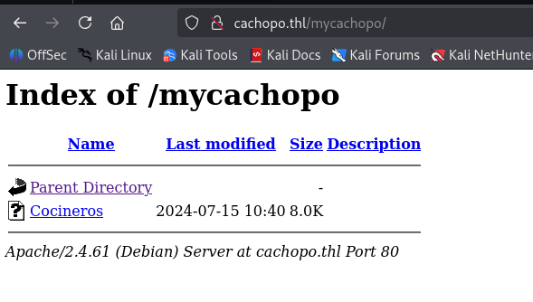

# TALLER CACHOPO
# CC DIEGO CABUYA - MY YERSON TORRES


## Fase 1: Reconocimiento de red

En esta fase se realiza la verificación inicial de conectividad y la detección de puertos abiertos en la máquina objetivo, empleando herramientas esenciales de red.

---

### 1.1 Verificación de conectividad con `ping`

Se utiliza la herramienta `ping` para comprobar si la máquina responde a paquetes ICMP. Esto permite confirmar que el host está activo y accesible desde nuestra máquina atacante.

#### Comando utilizado:

```bash
ping 192.168.129.207
```

#### Desglose del comando:

| Componente        | Descripción                                                                 |
|-------------------|-----------------------------------------------------------------------------|
| `ping`            | Herramienta para verificar conectividad mediante envío de paquetes ICMP.    |
| `192.168.129.207` | Dirección IP del host objetivo.                                              |

**Resultado**: la máquina respondió correctamente, confirmando que está activa en la red.


---

### 1.2 Escaneo de puertos con `nmap`

Una vez confirmada la conectividad, se realiza un escaneo completo de puertos TCP con `nmap` para identificar los servicios disponibles. Se utiliza una configuración agresiva para asegurar velocidad y profundidad en el análisis.

#### Comando utilizado:

```bash
sudo nmap -sSCV -p- -n -Pn --min-rate 5000 192.168.129.207
```

#### Desglose del comando:

| Componente            | Descripción                                                                 |
|------------------------|------------------------------------------------------------------------------|
| `sudo`                | Requiere permisos administrativos para escaneo completo.                    |
| `nmap`                | Herramienta de escaneo de redes.                                            |
| `-sS`                 | Realiza un escaneo TCP SYN (rápido y sigiloso).                             |
| `-sC`                 | Ejecuta los scripts por defecto de NSE (Nmap Scripting Engine).             |
| `-sV`                 | Detecta las versiones de los servicios encontrados.                         |
| `-p-`                 | Escanea todos los puertos TCP (1 al 65535).                                 |
| `-n`                  | Evita la resolución DNS.                                                    |
| `-Pn`                 | Omite la detección de host; se asume que está activo.                       |
| `--min-rate 5000`     | Fuerza una tasa mínima de 5000 paquetes por segundo para acelerar el escaneo. |
| `192.168.129.207`     | Dirección IP del objetivo.                                                  |

**Resultado del escaneo**:

- Puerto **22/tcp** Servicio SSH activo (`tcpwrapped`)
- Puerto **80/tcp** Servicio HTTP activo (`tcpwrapped`)

Esto indica que ambos servicios están disponibles pero protegidos, probablemente detrás de un wrapper de seguridad.


## Fase 2: Enumeración del servicio web

En esta fase se analizan los recursos visibles y ocultos en el servidor web expuesto por la máquina, con el objetivo de recolectar información útil para avanzar hacia una posible intrusión.

---

### 2.1 Exploración del sitio web principal

Se accede al servicio HTTP desde el navegador utilizando la dirección del host objetivo. El sitio presenta una imagen de un plato de comida, sin vínculos ni formularios visibles que puedan explotarse directamente.

#### URL visitada:

```
http://cachopo.thl
```

**Resultado**: el sitio carga correctamente una imagen estética, lo cual sugiere la posibilidad de que se haya ocultado información dentro del archivo mostrado.


---

### 2.2 Esteganografía con StegCracker

Se sospecha que la imagen descargada contiene información oculta mediante esteganografía. Se utiliza la herramienta `stegcracker` junto con la lista de contraseñas `rockyou.txt` para intentar romper la clave.

#### Comando utilizado:

```bash
stegcracker cachopo.jpg /usr/share/wordlists/rockyou.txt
```

#### Desglose del comando:

| Componente                          | Descripción                                                                 |
|-------------------------------------|------------------------------------------------------------------------------|
| `stegcracker`                       | Herramienta para romper contraseñas de archivos con esteganografía.         |
| `cachopo.jpg`                       | Imagen sospechosa que podría contener información oculta.                   |
| `/usr/share/wordlists/rockyou.txt` | Lista de contraseñas usada para ataque de diccionario.                      |

**Resultado**: contraseña descubierta `doggies`.


---

### 2.3 Extracción con Steghide

Con la contraseña obtenida (`doggies`), se utiliza `steghide` para extraer los datos ocultos del archivo de imagen.

#### Comando utilizado:

```bash
steghide extract -sf cachopo.jpg
```

#### Desglose del comando:

| Componente        | Descripción                                                              |
|-------------------|---------------------------------------------------------------------------|
| `steghide`        | Herramienta para ocultar o extraer datos de archivos multimedia.         |
| `extract`         | Indica que se realizará una extracción.                                  |
| `-sf cachopo.jpg` | Especifica el archivo fuente del cual extraer la informaci贸n oculta.     |

**Resultado**: se extrajo el archivo `directorio.txt`.


---

### 2.4 Visualización del archivo extraído

Se utiliza el comando `cat` para visualizar el contenido del archivo `directorio.txt`, lo que permite identificar un nuevo recurso en el servidor web.

#### Comando utilizado:

```bash
cat directorio.txt
```

#### Desglose del comando:

| Componente        | Descripción                                         |
|-------------------|-----------------------------------------------------|
| `cat`             | Comando para visualizar el contenido de un archivo. |
| `directorio.txt`  | Archivo extraído de la imagen mediante Steghide.    |

**Resultado**: el archivo contiene el texto `el directorio es mycachopo`.


---

### 2.5 Acceso al directorio oculto

Se navega al directorio `/mycachopo` en el servidor web, revelando un nuevo archivo llamado `Cocineros`.

#### URL visitada:

```
http://cachopo.thl/mycachopo/
```

**Resultado**: se accede correctamente al directorio y se identifica un archivo descargable.


