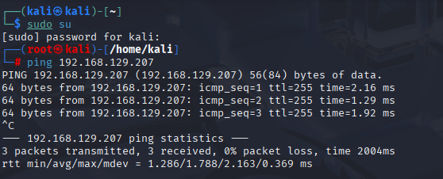

# TALLER CACHOPO
# CC DIEGO CABUYA - MY YERSON TORRES


## Fase 1: Reconocimiento de red

En esta fase se realiza la verificación inicial de conectividad y la detección de puertos abiertos en la máquina objetivo, empleando herramientas esenciales de red.

---

### 1.1 Verificación de conectividad con `ping`

Se utiliza la herramienta `ping` para comprobar si la máquina responde a paquetes ICMP. Esto permite confirmar que el host está activo y accesible desde nuestra máquina atacante.

#### Comando utilizado:

```bash
ping 192.168.129.207
```

#### Desglose del comando:

| Componente        | Descripci贸n                                                                 |
|-------------------|-----------------------------------------------------------------------------|
| `ping`            | Herramienta para verificar conectividad mediante envío de paquetes ICMP.    |
| `192.168.129.207` | Dirección IP del host objetivo.                                              |

**Resultado**: la máquina respondió correctamente, confirmando que está activa en la red.



---

### 1.2 Escaneo de puertos con `nmap`

Una vez confirmada la conectividad, se realiza un escaneo completo de puertos TCP con `nmap` para identificar los servicios disponibles. Se utiliza una configuración agresiva para asegurar velocidad y profundidad en el análisis.

#### Comando utilizado:

```bash
sudo nmap -sSCV -p- -n -Pn --min-rate 5000 192.168.129.207
```

#### Desglose del comando:

| Componente            | Descripción                                                                 |
|------------------------|------------------------------------------------------------------------------|
| `sudo`                | Requiere permisos administrativos para escaneo completo.                    |
| `nmap`                | Herramienta de escaneo de redes.                                            |
| `-sS`                 | Realiza un escaneo TCP SYN (rápido y sigiloso).                             |
| `-sC`                 | Ejecuta los scripts por defecto de NSE (Nmap Scripting Engine).             |
| `-sV`                 | Detecta las versiones de los servicios encontrados.                         |
| `-p-`                 | Escanea todos los puertos TCP (1 al 65535).                                 |
| `-n`                  | Evita la resolución DNS.                                                    |
| `-Pn`                 | Omite la detección de host; se asume que está activo.                       |
| `--min-rate 5000`     | Fuerza una tasa mínima de 5000 paquetes por segundo para acelerar el escaneo. |
| `192.168.129.207`     | Dirección IP del objetivo.                                                  |

**Resultado del escaneo**:

- Puerto **22/tcp** Servicio SSH activo (`tcpwrapped`)
- Puerto **80/tcp** Servicio HTTP activo (`tcpwrapped`)

Esto indica que ambos servicios están disponibles pero protegidos, probablemente detrás de un wrapper de seguridad.


